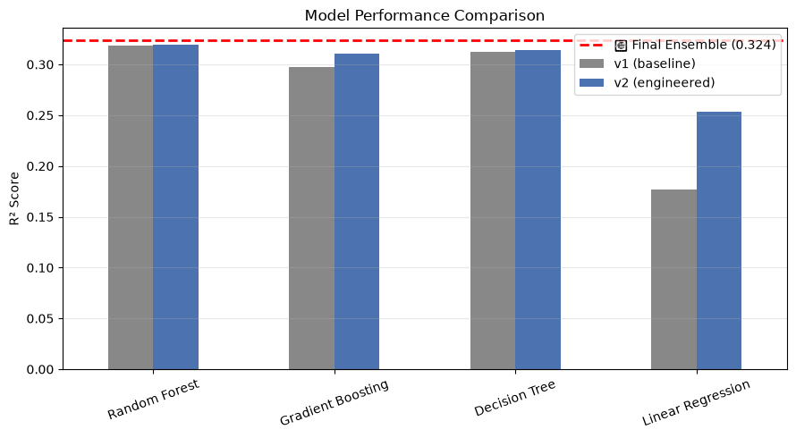
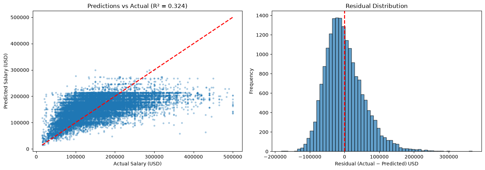

# Data Science Salary Predictor

An end-to-end machine learning project that predicts data science salaries 
(in USD) based on job title, experience level, location, and other features.

## Project Overview

- **Dataset**: 93,597 rows from Kaggle (data science salaries, 2020-2025)
- **Target**: `salary_in_usd`
- **Task**: Supervised regression
- **Best Model**: Voting Ensemble (Random Forest + XGBoost + LightGBM)
- **Final R2**: 0.324 (5-fold CV verified)

## Results

| Model | R2 Score | MAE |
|---|---|---|
| **Voting Ensemble** | **0.324** | **$44,445** |
| LightGBM | 0.323 | $44,480 |
| XGBoost | 0.323 | $44,502 |
| Random Forest | 0.320 | $44,603 |
| Decision Tree | 0.314 | $44,755 |
| Gradient Boosting | 0.311 | $44,962 |
| Linear Regression | 0.253 | $47,150 |

**Business metrics:**
- Mean prediction error: **$187** (unbiased)
- 64.8% of predictions within **$50K**
- 35.4% of predictions within **$25K**

### Model Comparison Chart


### Predictions vs Actual


## Key Insights

1. **`job_title_avg_salary`** dominates feature importance (55%) - engineered 
   feature that encodes the mean salary per job title (computed on training data 
   only to avoid leakage).

2. **Experience level** contributes 16%, **employee location** 16%.

3. **Location, remote ratio, company size, and year** contribute only marginally - 
   the bulk of salary variance lives *outside* this dataset (specific company, 
   equity, negotiation, cost-of-living).

## Project Structure
Salary-Prediction-IBM/
├── data/
│ └── DataScience_salaries_2025.csv
├── models/
│ ├── salary_model.pkl # Trained ensemble (34 MB)
│ ├── encoders.pkl # LabelEncoders for categoricals
│ ├── title_mean.pkl # job_title -> avg salary mapping
│ ├── global_mean.pkl # fallback mean
│ ├── feature_columns.pkl # column order
│ ├── comparison.png
│ └── residuals.png
├── notebooks/
│ └── employee-salary.ipynb # Full EDA + modeling
├── src/
│ └── predict.py # CLI prediction script
├── requirements.txt
└── README.md

## Quickstart

### 1. Install dependencies

```bash
pip install -r requirements.txt
2. Run a prediction
bash
python src/predict.py --title "Data Scientist" --exp SE --company_loc US
Output:

text
=======================================================
  Job Title:      Data Scientist
  Experience:     SE
  Location:       US
  Title avg:      $156,173
  Predicted:      $172,037 USD
=======================================================
CLI Arguments
Arg	Default	Options
--title	required	e.g., "Data Scientist"
--exp	SE	EN, MI, SE, EX
--emp	FT	FT, PT, CT, FL
--residence	US	country code
--remote	0	0, 50, 100
--company_loc	US	country code
--company_size	M	S, M, L
--year	2025	int
Methodology
Data Cleaning - Removed leakage columns (salary, salary_currency),
filtered outliers (kept $1K-$500K).

Feature Engineering

Grouped 317 job titles to top-65 (rare titles -> "Other")

Engineered job_title_avg_salary (train-only, no leakage)

Added interaction features exp_x_title, year_x_title

Modeling - Trained 6 models + 1 voting ensemble, validated with 5-fold CV.

Artifacts - Saved model + encoders + feature engineering assets with joblib
(compressed to 34 MB via zlib compression).

Limitations
R2 = 0.324 is honest. Salary depends heavily on unrecorded factors:
specific company, equity/RSU, team, negotiation, exact years of experience.

Model regresses to the mean - under-predicts high earners, over-predicts
low earners.

Dataset is dominated by US data; predictions for other regions are less reliable.

Stack
Python 3.10+ | pandas | scikit-learn | XGBoost | LightGBM | joblib |
matplotlib | seaborn

Author
Built as a portfolio project to learn end-to-end ML deployment.
